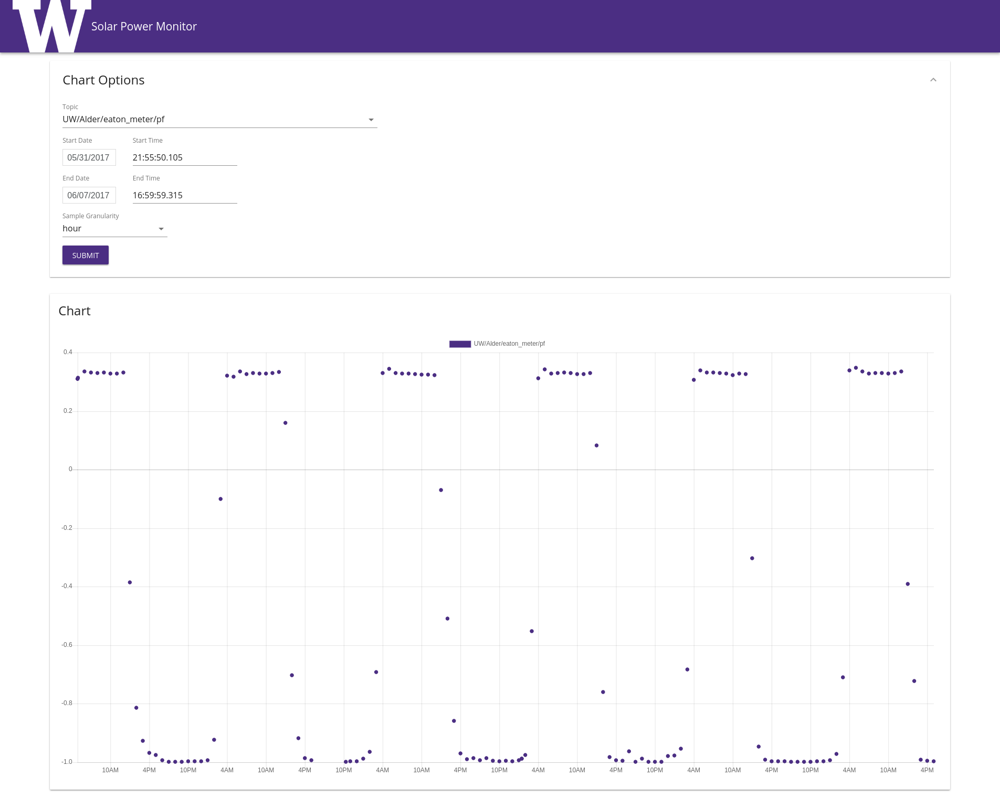

# UW Solar Power Monitor

A web service to show data from solar panels deployed around the University of Washington.

<p align="center">
  
</p>

### Requirements

In order to build and run the web server, a few dependencies must be present:

* Bash (https://www.gnu.org/software/bash/)
* Node.js (https://nodejs.org/en/)
* Python 3 (https://www.python.org/download/releases/3.0/)
* Wget (https://www.gnu.org/software/wget/)

#### Getopt

Some users (such as those running FreeBSD or MacOS) may notice issues related to getopt.

```bash
$ scripts/start.sh
flags:WARN getopt: illegal option -- -
getopt: illegal option -- n
getopt: illegal option -- o
getopt: illegal option -- d
-e lete_shflags --
flags:FATAL unable to parse provided options with getopt.
```

These platforms do not ship with a version of getopt that supports long command arguments, so a replacement must be installed.

##### FreeBSD

FreeBSD users may download a replacement getopt from the Ports Collection (https://svnweb.freebsd.org/ports/head/misc/getopt/).

```bash
$ sudo pkg install getopt
$ PATH=/usr/local/bin:$PATH scripts/start.sh
```

### Download

Git (https://git-scm.com) is required to download the source code.

```bash
$ git clone https://github.com/kjiwa/lotus-leaf.git
```

### Quick Start

Use ```start.sh``` to execute an optimized web server with an empty in-memory SQLite database. This script will download additional dependencies, build the source code, and run the server.

Optionally, use ```db-migrate.sh``` and ```db-gendata.sh``` to create a new SQLite database and populate it with data. Start the web server application using the newly created database.

```bash
$ scripts/db-migrate.sh --db_host=sqlite.db
$ scripts/db-gendata.sh -- --db_host=sqlite.db --input_file=db/gendata/sample-square.json
$ scripts/start.sh -- --db_host=sqlite.db
```

After running these commands, a SQLite database will be created and filled with sample data in the shape of a square wave. All application dependencies will also be installed, so subsequent invocations of ```start.sh``` can be sped up by skipping the cleaning and setup stages. Finally, setting the ```--debug``` flag speeds up compilation of the frontend and enables debugging.

```bash
$ scripts/start.sh --noclean --nosetup --debug -- --db_host=sqlite.db
```

#### Connecting to a MySQL Database

The server can be configured to connect to and read data from an existing MySQL installation.

```bash
$ scripts/start.sh -- --db_type=mysql+mysqlconnector --db_host=localhost --db_name=uwsolar
```
